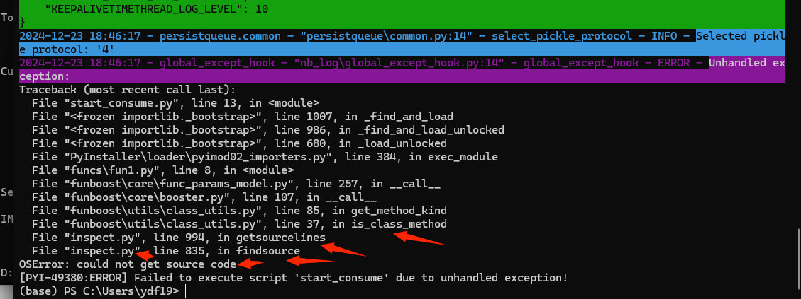

#  使用 pyinstaller 打包 funboost项目为exe 说明文档


## 1 打包命令 

```
cd  D:\codes\funboost_pyinstaller

pyinstaller -F start_consume.py

```


## 2. 如果装饰器没加 consuming_function_kind=FunctionKind.XXXX， 上面打包一后运行定会遇到如下报错



```
2024-12-23 18:46:17 - global_except_hook - "nb_log\global_except_hook.py:14" - global_except_hook - ERROR - Unhandled exception:
Traceback (most recent call last):
  File "start_consume.py", line 13, in <module>
  File "<frozen importlib._bootstrap>", line 1007, in _find_and_load
  File "<frozen importlib._bootstrap>", line 986, in _find_and_load_unlocked
  File "<frozen importlib._bootstrap>", line 680, in _load_unlocked
  File "PyInstaller\loader\pyimod02_importers.py", line 384, in exec_module
  File "funcs\fun1.py", line 8, in <module>
  File "funboost\core\func_params_model.py", line 257, in __call__
  File "funboost\core\booster.py", line 107, in __call__
  File "funboost\utils\class_utils.py", line 85, in get_method_kind
  File "funboost\utils\class_utils.py", line 37, in is_class_method
  File "inspect.py", line 994, in getsourcelines
  File "inspect.py", line 835, in findsource
OSError: could not get source code
[PYI-49380:ERROR] Failed to execute script 'start_consume' due to unhandled exception!
```

报错原因：
```
报这个错的原因是，funboost需要根据代码动态获取函数的类型，到底是普通函数，函数实例方法还是类方法还是静态方法，然后传给 consuming_function_kind
打包的时候并没有包括源代码，所以有2个解决方式
见如下2种解决方式
```

### 2.2 解决方式1,手动指定  consuming_function_kind= FunctionKind.XXXX

```
方式1是 BoosterParams 装饰器中指定 consuming_function_kind= FunctionKind.COMMON_FUNCTION，具体的值是看你的消费函数是哪一种。

导入 from funboost.constant import FunctionKind

一般推荐你的项目中洗个类继承 BoosterParams ，然后@boost使用这个类，这样就不需要你到处去每个函数修改一遍。
```

### 2.2 解决方式2， 打包时候将源码作为文件一起打包

```
方式2是 ，打包时候将源码作为文件一起打包，需要声明 .spec 文件中的 Analysis 的 datas ，具体的生成datas可以使用 get_py_files__dir(".") 函数， 
.spec其实就是py文件，里面可以写任何python代码，
start_consume_backup.spec ，这个文件是复制自 start_consume.spec ，然后修改了 datas的值，已经加了一个生成datas 的列表元祖。
然后你使用 pyinstaller start_consume_backup.spec 来打包，而不是指定一个python文件来打包，不要使用 pyinstaller start_consume.py打包。


用户自己的项目参考 本项目的 start_consume_backup.spec 的 get_py_files__dir函数，然后调用此函数传给datas。
```